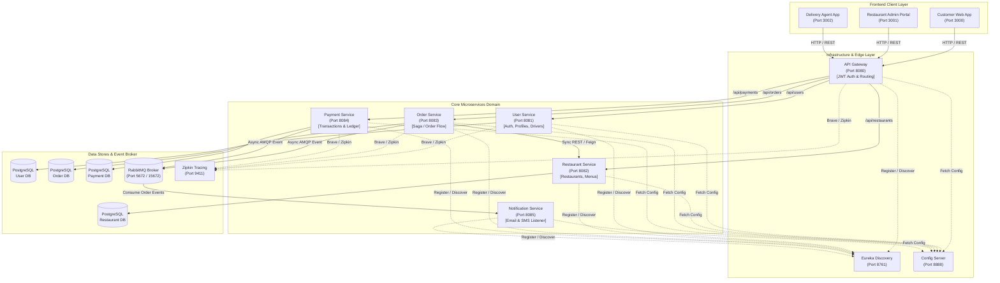

# Food Delivery System Architecture & Design

This document details the complete end-to-end **System Architecture** of the Food Delivery Microservices Platform.

---

## 🎨 Visual System Architecture Diagram

---

## 🧩 Interactive Component Architecture (Mermaid)

---

## 🏛️ System Layer Breakdown & Design Patterns

### 1. Client Applications (Frontend Layer)
- **Customer Web App (`:3000`)**: Allows users to register/login, browse restaurants & menus, manage shopping carts, checkout, and view order delivery status.
- **Restaurant Owner Portal (`:3001`)**: Enables restaurant managers to update menus, toggle item availability, and accept/prepare incoming orders.
- **Delivery Agent App (`:3002`)**: Dedicated portal for delivery personnel to view active delivery tasks, update delivery status, and complete orders.

### 2. Edge & Infrastructure Layer
- **Spring Cloud API Gateway (`:8080`)**: Single entrance point for all external traffic. Performs JWT token verification, dynamic route allocation, CORS handling, and request logging.
- **Eureka Discovery Server (`:8761`)**: Central service registry allowing services to locate and communicate with each other dynamically without hardcoded IPs.
- **Config Server (`:8888`)**: Central configuration management serving environment-specific properties from git/native configuration storage.

### 3. Core Microservices Domain
- **User Service (`:8081`)**: Manages customer profiles, delivery driver records, BCrypt password encryption, and JWT token issuance.
- **Restaurant Service (`:8082`)**: Catalog of restaurants, categories, menu items, prices, and availability flags.
- **Order Service (`:8083`)**: Handles order creation, cart calculations, order state transitions (CREATED, CONFIRMED, DELIVERED), and AMQP event publication.
- **Payment Service (`:8084`)**: Simulates payment processing, payment transactions, and payment status updates.
- **Notification Service (`:8085`)**: Asynchronous RabbitMQ listener that formats and dispatches email and SMS alerts when order events fire.

### 4. Data & Asynchronous Event Infrastructure
- **Database Per Service**: Each microservice maintains its own isolated PostgreSQL database schema to enforce domain boundaries and eliminate tight coupling.
- **RabbitMQ Message Broker (`:5672`)**: Decouples long-running side-effects (notifications, analytics) from HTTP request/response loops.
- **OpenZipkin (`:9411`)**: Provides end-to-end distributed tracing across all HTTP and AMQP service hops.

---

## 🔐 Security & Communication Flow

1. **Authentication Flow**:
   - Customer logs in via Gateway `POST /api/users/login`.
   - `User Service` validates credentials and returns a signed **JWT Bearer Token**.
   - Subsequent HTTP requests include `Authorization: Bearer <token>`.
   - `API Gateway` validates token integrity before forwarding traffic downstream.

2. **Order Placement Flow (Event-Driven)**:
   - Client sends `POST /api/orders` to Gateway.
   - `Order Service` validates order data, persists order to `Order DB`, and publishes an `order.created` event to RabbitMQ.
   - `Notification Service` listens to `order.created` and asynchronously dispatches confirmation notifications.
